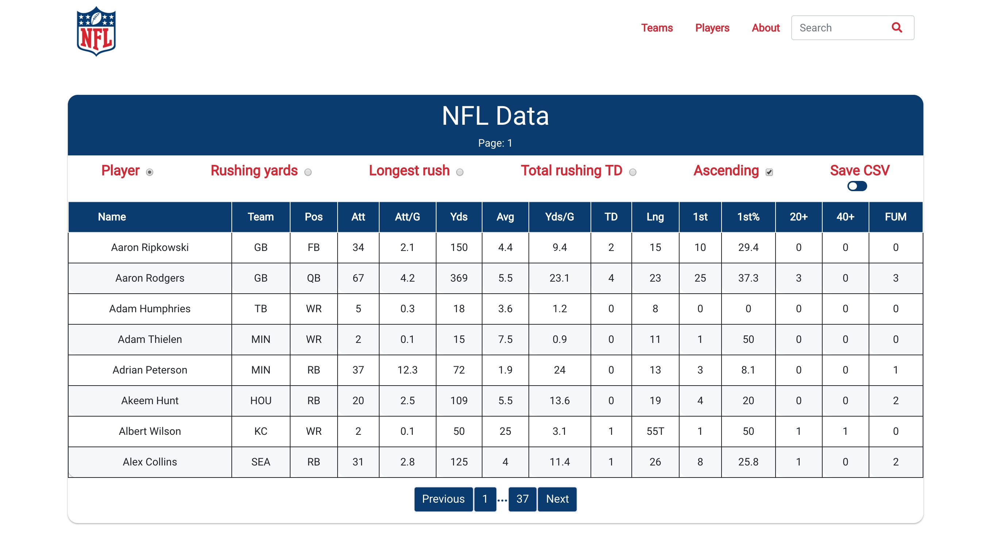

# NFL Rush

An App built with React to sort out data about NFL players.

## Getting Started

These instructions will get you a copy of the project up and running on your local machine for development and testing purposes. See deployment for notes on how to deploy the project on a live system.

### Prerequisites

Node.js, React

### Installing

To run the app follow these procedures:

```
git clone git@github.com:danielvallecl/nfl_rush.git
```

Change directory into the nfl_rush folder then run:

```
npm install
```

After the dependencies have been installed run:

```
npm start
```

The app will open on port 3000 on your browser.

A live version of the application is also hosted on my personal website:

* [NFL RUSH](http://www.danielvalle.ca/nfl_rush.html)

## Instructions



* The initial page shows all players sorted by name and paginated
* The NFL logo on the left brings you back to the initial page

### Navigation Menu Options:

** Teams: Lets you select your preferred team and displays the player roster
** Players: Lets you select and display your player and detailed data
** About: Displays information about the NFL
** Search: Lets you search players by typing parts of their name

### Navigation Menu Options:
